# Synesthetic MCP

Minimal, deterministic MCP-style adapter exposing schemas, examples, validation, diff, and an optional backend-populate tool.

## System Context

```mermaid
flowchart LR
  FE["sdfk_fe_ts\n(TypeScript Frontend)"]
  BE["sdfk-backend\n(Python API & CRUD)"]
  MCP["synesthetic-mcp\n(Python MCP Adapter)"]
  SSOT["synesthetic-schemas\n(SSOT: Schemas + Examples)"]

  MCP --> |Validates + Persists| BE
  SSOT --> |Submodule| MCP
  SSOT --> |Types| FE

  style MCP fill:#444444,stroke:#ffffff,stroke-width:2px
```


## Features

- Schema and example discovery
- JSON Schema validation (Draft 2020-12)
- RFC6902 diff (add/remove/replace only)
- Backend population (optional via `SYN_BACKEND_URL`)
- Minimal stdio loop; optional HTTP app factory

## Structure

```
README.md
requirements.txt
docs/
  mcp_spec.md
mcp/
  __init__.py
  core.py
  validate.py
  diff.py
  backend.py
  stdio_main.py
  http_main.py
tests/
  test_validate.py
  test_diff.py
  test_backend.py
  test_env_discovery.py
  fixtures/
    schemas/asset.schema.json
meta/
  prompts/
```

## Development

* Python >= 3.11
* Install deps (minimal): `pip install -r requirements.txt`
* Import check: `python -c "import mcp; print(mcp.__version__)"`
* Run tests: `pytest -q`
* Runtimes:
  - `python -m mcp.stdio_main` (newline-delimited JSON requests)
  - `uvicorn 'mcp.http_main:create_app'` (FastAPI optional)

### Submodule (SSOT)

Authoritative schemas/examples live at `libs/synesthetic-schemas` (git submodule).

Order of discovery used by the adapter:
1) `SYN_SCHEMAS_DIR` and `SYN_EXAMPLES_DIR` if set
2) `libs/synesthetic-schemas/jsonschema` and `libs/synesthetic-schemas/examples` if present
3) `tests/fixtures/schemas` and `tests/fixtures/examples` as fallback

Initialize the submodule:

```
git submodule update --init --recursive
```

### Schema Aliases (Nested Assets)

Some downstream APIs accept a nested variant of the synesthetic asset shape. To keep validation simple and deterministic while preserving the canonical JSON Schema as the single source of truth, the adapter supports a lightweight alias:

- Alias: `nested-synesthetic-asset`
- Canonical schema: `synesthetic-asset`

Behavior in this repo:
- When validating with `schema="nested-synesthetic-asset"`, the adapter loads the canonical `synesthetic-asset` JSON Schema from the submodule and validates against it.
- For examples from `libs/synesthetic-schemas/examples/SynestheticAsset_Example*.json`, the adapter infers the schema name `nested-synesthetic-asset` automatically.
- During validation, a top-level `$schemaRef` key present in examples is ignored. This avoids false positives with `additionalProperties: false` in the canonical schema while retaining deterministic validation.

Notes for contributors:
- `get_schema("synesthetic-asset")` returns the canonical schema object; the canonical schema currently does not define a top-level `version` field, so the helper `get_schema(...)["version"]` will be an empty string.
- Tests validate submodule examples using the nested alias. Local, non-canonical example fixtures were removed to ensure the submodule remains the single source of truth.

### Docker

Build and run tests in a container:

```
./test.sh
```

Notes:
- `docker-compose.yml` passes through env if set; there are no defaults to fixtures. The adapter’s own discovery logic picks the right source.
- No backend service is started by compose; backend calls are disabled unless `SYN_BACKEND_URL` is set.

## Spec

See `docs/mcp_spec.md` for deterministic IO contracts and limits.

## Status

✅ Spec pinned in `docs/mcp_spec.md`
✅ Minimal implementation with tests
