# Synesthetic MCP

Lightweight **Model Context Protocol (MCP)** server for Synesthetic assets.  
This repo adapts the canonical [synesthetic-schemas](https://github.com/delk73/synesthetic-schemas) into MCP resources and tools.

- **Resources**: schemas, examples (read-only, from SSOT).  
- **Tools**: validation, diff (RFC6902 patch ops), backend population.  
- **Guards**: enforce schema compliance before persistence.

## System Context

```mermaid
flowchart LR
  FE["sdfk_fe_ts\n(TypeScript Frontend)"]
  BE["sdfk-backend\n(Python API & CRUD)"]
  MCP["synesthetic-mcp\n(Python MCP Adapter)"]
  RLHF["sdfk_rlhf\n(RLHF Asset Generation)"]
  SSOT["synesthetic-schemas\n(SSOT: Schemas + Codegen)"]

  FE --> |Consumes API| BE
  RLHF --> |Generates Assets via MCP| MCP
  MCP --> |Validates + Persists| BE
  SSOT --> |Submodule + Python pkg| MCP
  SSOT --> |TypeScript types| FE
  SSOT --> |Python models| BE

  style MCP fill:#444444,stroke:#ffffff,stroke-width:2px
```



## Features

* **Schema & example discovery** (via `mcp/core.py`)
* **Validation** with `jsonschema` + Pydantic (see `mcp/validate.py`)
* **Diffing** with RFC6902 JSON Patch ops (see `mcp/diff.py`)
* **Backend proxy** to the API (see `mcp/backend.py`)
* **Runtimes**: stdio JSON-RPC adapter and optional HTTP adapter

## Structure

```
synesthetic-mcp/
  README.md
  requirements.txt
  install.sh
  docs/
    mcp_spec.md
  mcp/
    __init__.py
    core.py
    validate.py
    diff.py
    backend.py
    stdio_main.py
    http_main.py
  tests/
    test_validate.py
    test_diff.py
    test_tools.py
    fixtures/
      valid_asset.json
      invalid_asset.json
  meta/
    prompts/
```

## Development

* Written in **Python (>=3.11, tested on 3.11–3.13)**
* Depends on generated Python models from [`synesthetic-schemas`](https://github.com/delk73/synesthetic-schemas)
* Tests use **pytest** and golden fixtures
* Runtimes:

  * `python -m mcp.stdio_main --stdio` (JSON-RPC stdio loop)
  * `uvicorn 'mcp.http_main:create_app'` (HTTP adapter, FastAPI optional)

## Spec

See [docs/mcp\_spec.md](docs/mcp_spec.md) for the pinned v1 specification.

## Status

✅ Spec pinned in `docs/mcp_spec.md`
🚧 Implementation scaffolding in progress