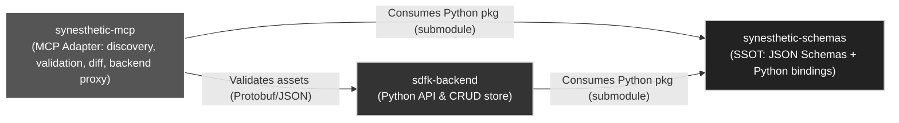

# Synesthetic MCP

Minimal, deterministic MCP-style adapter exposing schemas, examples, validation, diff, and an optional backend-populate tool.

## System Context


## Features

- Schema and example discovery
- JSON Schema validation (Draft 2020-12)
- RFC6902 diff (add/remove/replace only)
- Backend population (optional via `SYN_BACKEND_URL`)
- Minimal stdio loop; optional HTTP app factory

## Quickstart

1. Install deps: `pip install -r requirements.txt && pip install -e .`
2. Initialize schemas/examples: `git submodule update --init --recursive`.
3. Serve via Compose: `docker compose up serve` (binds `http://localhost:7000` and exposes `/healthz`).
4. Or run the helper: `./serve.sh` builds the image, waits for a healthy container, then tails logs.
5. Validate an asset locally: `python -m mcp --validate libs/synesthetic-schemas/examples/SynestheticAsset_Example1.json`.

## Structure

```
README.md
requirements.txt
docs/
  mcp_spec.md
mcp/
  __init__.py
  core.py
  validate.py
  diff.py
  backend.py
  stdio_main.py
  http_main.py
tests/
  test_validate.py
  test_diff.py
  test_backend.py
  test_env_discovery.py
  test_http.py
  test_stdio.py
  test_submodule_integration.py  
```

## Development

* Python >= 3.11
* Install deps (minimal): `pip install -r requirements.txt`
  - Minimal deps: `jsonschema`, `httpx`, `pytest`
  - Optional extras: `fastapi` (HTTP app), `uvicorn` (dev server), `referencing` (enhanced JSON Schema refs; import is optional)
  - Dev (optional): `ruff`, `mypy`
* Import check: `python -c "import mcp; print(mcp.__version__)"`
* Run tests: `pytest -q`
* Runtimes:
  - `python -m mcp` (blocking server with `/healthz` HTTP probe)
  - `python -m mcp.stdio_main` (newline-delimited JSON requests)
  - `uvicorn 'mcp.http_main:create_app'` (FastAPI optional)

## Dependencies

- Runtime: `jsonschema`, `httpx`
- Tests: `pytest`
- Dev (optional): `ruff`, `mypy`
- Extras (optional): `fastapi`, `uvicorn` (HTTP adapter), `referencing` (ref handling performance/behavior)

## Environment

| Variable | Default | Behaviour |
| - | - | - |
| `MCP_HOST` | `0.0.0.0` | Bind address for `python -m mcp`; edit for local-only usage. |
| `MCP_PORT` | `7000` | TCP port for the HTTP health server (`/healthz`) and Compose port mapping. |
| `SYN_SCHEMAS_DIR` | `libs/synesthetic-schemas/jsonschema` when present | Overrides schema directory; required when submodule absent. Startup fails if the directory is missing. |
| `SYN_EXAMPLES_DIR` | `libs/synesthetic-schemas/examples` when present | Overrides examples directory; discovery falls back to submodule if unset. |
| `SYN_BACKEND_URL` | unset | Enables backend POSTs; missing keeps populate disabled (`unsupported`). |
| `SYN_BACKEND_ASSETS_PATH` | `/synesthetic-assets/` | Custom path for backend POST requests. |

`.env.example` captures these defaults for quick copying into local shells or Compose.

### Environment Discovery

- `SYN_SCHEMAS_DIR` and `SYN_EXAMPLES_DIR` override paths when set.
- Otherwise, schemas/examples are loaded from the `libs/synesthetic-schemas` submodule.
- If neither is available, listings are empty and get operations return not found (no fixture fallback).

### Submodule (SSOT)

Authoritative schemas/examples live at `libs/synesthetic-schemas` (git submodule).

Order of discovery used by the adapter:
1) `SYN_SCHEMAS_DIR` and `SYN_EXAMPLES_DIR` if set
2) `libs/synesthetic-schemas/jsonschema` and `libs/synesthetic-schemas/examples` if present
3) If neither exists, listings are empty and get operations return not found

Initialize the submodule:

```
git submodule update --init --recursive
```

### Schema Aliases (Nested Assets)

* **`synesthetic-asset`** → canonical schema (flat).
* **`nested-synesthetic-asset`** → alias for assets with components inlined.
* All component types may be embedded (shader, tone, haptic, control, modulation, rule bundle).
* Alias validation loads the canonical `synesthetic-asset` schema.
* Examples `SynestheticAsset_Example*.json` are treated as `nested-synesthetic-asset`.
* `$schemaRef` in examples is ignored during validation.
* Tests use the nested alias; submodule is the single source of truth.

## Error Model

- Validation failed: `{ ok:false, reason:'validation_failed', errors:[{ path, msg }] }`
- Backend error: `{ ok:false, reason:'backend_error', status, detail }`
- Unsupported tool/resource: `{ ok:false, reason:'unsupported', msg }`
- Network errors map to backend_error with `status:503` and a brief `detail`.

## CLI Usage

```
$ python -m mcp --validate path/to/asset.json
{"ok": true, "errors": [], "schema": "nested-synesthetic-asset"}
```

- Exit code `0`: validation succeeded.
- Exit code `1`: validation failed (payload includes `reason: validation_failed`).
- Exit code `2`: input errors (file missing, unreadable, or invalid JSON).

### Docker

Build and run tests in a container:

```
./test.sh
```

Notes:
- `docker-compose.yml` passes through env if set; there are no defaults to fixtures. The adapter’s own discovery logic picks the right source.
- No backend service is started by compose; backend calls are disabled unless `SYN_BACKEND_URL` is set.

### Serving Locally

- `docker compose up serve` (or `./serve.sh`) builds the image, starts `python -m mcp`, waits for a health check on `/healthz`, and tails logs.
- The service binds `http://localhost:7000` by default; override with `MCP_PORT=7100 docker compose up serve` or `MCP_PORT=7100 ./serve.sh`.
- `MCP_HOST` defaults to `0.0.0.0` for container networking and can be tightened for local-only usage.

## Spec

See `docs/mcp_spec.md` for deterministic IO contracts and limits.

## Status

✅ Spec pinned in `docs/mcp_spec.md`
✅ Minimal implementation with tests
