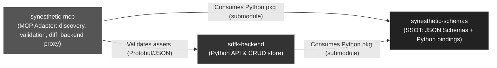

# Synesthetic MCP

Minimal, deterministic MCP-style adapter exposing schemas, examples, validation, diff, and an optional backend-populate tool.

## System Context


## Features

- Schema and example discovery
- JSON Schema validation (Draft 2020-12)
- Batch validation via `validate_many` with `MCP_MAX_BATCH` (default 100)
- RFC6902 diff (add/remove/replace only)
- Backend population (optional via `SYN_BACKEND_URL`)
- Canonical STDIO JSON-RPC loop with optional Unix-domain socket (`MCP_MODE=socket`) and TCP (`MCP_MODE=tcp`, `MCP_HOST`, `MCP_PORT`) transports; legacy `MCP_ENDPOINT` remains supported
- Per-request 1 MiB payload guard enforced before parsing across STDIO, socket, and TCP transports
- Deprecated `validate` alias remains available but logs a warning; prefer `validate_asset`
- Strict asset contract: top-level `$schema` is required and legacy `schema`/`$schemaRef` keys are rejected (v0.2.8)

## Quickstart

1. Install deps: `pip install -r requirements.txt && pip install -e .`
2. Initialize schemas/examples: `git submodule update --init --recursive`.
3. Serve via Compose: `docker compose up serve` (runs the transport, logs `mcp:ready mode=<endpoint>` with ISO-8601 timestamps, and exposes `/tmp/mcp.ready` for health checks).
4. Or run the helper: `./up.sh` builds the image and starts the serve service in the background; follow with `docker compose logs -f serve` if you want to tail logs.
5. Validate an asset locally: `python -m mcp --validate libs/synesthetic-schemas/examples/SynestheticAsset_Example1.json`.

## Structure

```
README.md
requirements.txt
docs/
  mcp_spec.md
mcp/
  __init__.py
  core.py
  validate.py
  diff.py
  backend.py
  stdio_main.py
  socket_main.py
  transport.py
tests/
  test_validate.py
  test_diff.py
  test_backend.py
  test_env_discovery.py
  test_stdio.py
  test_submodule_integration.py  
```

## Development

* Python >= 3.11
* Install deps (minimal): `pip install -r requirements.txt`
  - Minimal deps: `jsonschema`, `httpx`, `pytest`
  - Optional extras: `referencing` (enhanced JSON Schema refs; import is optional)
  - Dev (optional): `ruff`, `mypy`
* Import check: `python -c "import mcp; print(mcp.__version__)"`
* Run tests: `pytest -q`
* Runtimes:
  - `python -m mcp` (defaults to TCP; override with `MCP_MODE=stdio` or `MCP_MODE=socket`. Legacy `MCP_ENDPOINT` remains supported for compatibility. Logs `mcp:ready mode=<mode>` with canonical schema metadata).
  - `python -m mcp.stdio_main` (invoke the STDIO loop directly when embedding).

## Dependencies

- Runtime: `jsonschema`, `httpx`
- Tests: `pytest`
- Dev (optional): `ruff`, `mypy`
- Extras (optional): `referencing` (ref handling performance/behavior)

## Environment

| Variable | Default | Behaviour |
| - | - | - |
| `MCP_MODE` | `tcp` | Primary transport selector (`tcp`, `stdio`, or `socket`). |
| `MCP_ENDPOINT` | *unset* | Back-compat alias for older deployments; overrides `MCP_MODE` when set. |
| `MCP_READY_FILE` | `/tmp/mcp.ready` | File touched on startup with `<pid> <ISO8601>` and removed on shutdown; Compose health checks test for its presence. Override when sandboxed. |
| `MCP_SOCKET_PATH` | `/tmp/mcp.sock` | Socket path when `MCP_ENDPOINT=socket`. The server unlinks the file on shutdown. |
| `MCP_SOCKET_MODE` | `0600` | Octal file mode applied to the socket on startup. Increase only when the socket must be shared. |
| `MCP_HOST` | `0.0.0.0` | TCP bind address when `MCP_ENDPOINT=tcp`. Use `127.0.0.1` for local development. |
| `MCP_PORT` | `8765` | TCP port when `MCP_ENDPOINT=tcp`. Set to `0` to request an ephemeral port (logged on startup). |
| `LABS_SCHEMA_BASE` | `https://delk73.github.io/synesthetic-schemas/schema/` | Canonical schema host prefix. |
| `LABS_SCHEMA_VERSION` | `0.7.3` | Canonical schema version folder appended to `LABS_SCHEMA_BASE`. |
| `LABS_SCHEMA_CACHE_DIR` | `~/.cache/synesthetic-schemas` | Optional on-disk cache for fetched canonical schemas (created per version). |
| `SYN_SCHEMAS_DIR` | `libs/synesthetic-schemas/jsonschema` when present | Overrides schema directory; required when submodule absent. Startup fails if the directory is missing. |
| `SYN_EXAMPLES_DIR` | `libs/synesthetic-schemas/examples` when present | Overrides examples directory; discovery falls back to submodule if unset. |
| `SYN_BACKEND_URL` | unset | Enables backend POSTs; missing keeps populate disabled (`unsupported`). |
| `SYN_BACKEND_ASSETS_PATH` | `/synesthetic-assets/` | Custom path for backend POST requests. |
| `MCP_MAX_BATCH` | `100` | Maximum batch size for `validate_many`; oversized batches return `{ok:false, reason:'unsupported'}`. |

`.env.example` captures these defaults for quick copying into local shells or Compose.

### Environment Discovery

- `SYN_SCHEMAS_DIR` and `SYN_EXAMPLES_DIR` override paths when set.
- Otherwise, schemas/examples are loaded from the `libs/synesthetic-schemas` submodule.
- If neither is available, listings are empty and get operations return not found (no fixture fallback).

### Submodule (SSOT)

Authoritative schemas/examples live at `libs/synesthetic-schemas` (git submodule).

Order of discovery used by the adapter:
1) `SYN_SCHEMAS_DIR` and `SYN_EXAMPLES_DIR` if set
2) `libs/synesthetic-schemas/jsonschema` and `libs/synesthetic-schemas/examples` if present
3) If neither exists, listings are empty and get operations return not found

Initialize the submodule:

```
git submodule update --init --recursive
```

Update the submodule to the latest published commit (`8286df4a4197f2fb45a8bd6c4a805262cba2e934` as of this audit):

```
git -C libs/synesthetic-schemas fetch origin
git -C libs/synesthetic-schemas checkout 0fdc842
git add libs/synesthetic-schemas
```

After checking out the new commit you can create a commit in the main repository, for example `git commit -m "chore: bump synesthetic-schemas to 8286df4a4197f2fb45a8bd6c4a805262cba2e934"`.

### Schema Aliases (Nested Assets)

* **`synesthetic-asset`** → canonical schema (flat).
* **`nested-synesthetic-asset`** → alias for assets with components inlined.
* All component types may be embedded (shader, tone, haptic, control, modulation, rule bundle).
* Alias validation loads the canonical `synesthetic-asset` schema.
* Examples `SynestheticAsset_Example*.json` are treated as `nested-synesthetic-asset`.
* Assets MUST declare their validating schema via top-level `$schema`; legacy `schema` or `$schemaRef` keys are rejected.
* Tests use the nested alias; submodule is the single source of truth.

## Error Model

- Validation failed: `{ ok:false, reason:'validation_failed', errors:[{ path, msg }] }`
- Backend error: `{ ok:false, reason:'backend_error', status, detail }`
- Unsupported tool/resource: `{ ok:false, reason:'unsupported', detail }`
- Network errors map to backend_error with `status:503` and a brief `detail`.
- Payload too large (>1 MiB on STDIO/socket/TCP): `{ ok:false, reason:'validation_failed', errors:[{ path:'', msg:'payload_too_large' }] }`

## CLI Usage

```
$ python -m mcp --validate path/to/asset.json
{"ok": true, "errors": []}
```

- Exit code `0`: validation succeeded.
- Exit code `1`: validation failed (payload includes `reason: validation_failed`).
- Exit code `2`: input errors (file missing, unreadable, or invalid JSON).

### Docker

Build and run tests in a container:

```
./test.sh
```

Notes:
- `docker-compose.yml` passes through env if set; there are no defaults to fixtures. The adapter’s own discovery logic picks the right source.
- No backend service is started by compose; backend calls are disabled unless `SYN_BACKEND_URL` is set.

### Serving Locally

- `docker compose up serve` builds the image, starts `python -m mcp`, waits for `/tmp/mcp.ready`, and keeps logs attached.
- `./up.sh` builds the image and starts the `serve` service in detached mode; run `docker compose logs -f serve` to follow output after startup.
- TCP is the default transport; set `MCP_MODE=stdio` for the STDIO loop or `MCP_MODE=socket` for the Unix-domain socket listener. `MCP_ENDPOINT` continues to work for legacy callers.
- Requests above 1 MiB (UTF-8 bytes) are rejected before parsing with `payload_too_large` on STDIO, socket, and TCP (see `tests/test_stdio.py`, `tests/test_socket.py`, and `tests/test_tcp.py`).

## Spec

See `docs/mcp_spec.md` for deterministic IO contracts and limits.

## Status

✅ Spec pinned in `docs/mcp_spec.md`
✅ Minimal implementation with tests


### Validating it

**Quick host check with `nc`:**

```bash
nc 127.0.0.1 8765
```

Paste this request:

```json
{"jsonrpc":"2.0","id":1,"method":"list_schemas"}
```

You should get a JSON response with available schemas.

**Labs connection env** (TCP transport with canonical schemas):

```bash
MCP_MODE=tcp
MCP_HOST=127.0.0.1      # or 'synesthetic-mcp-serve-1' if inside Docker network
MCP_PORT=8765
LABS_SCHEMA_BASE=https://delk73.github.io/synesthetic-schemas/schema/
LABS_SCHEMA_VERSION=0.7.3
```

**Run Labs against it:**

```bash
python -m labs.cli generate --prompt "hello world shader test"
```
